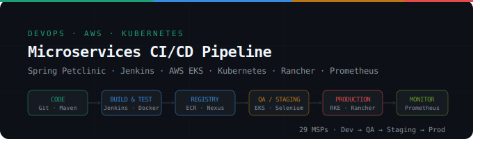
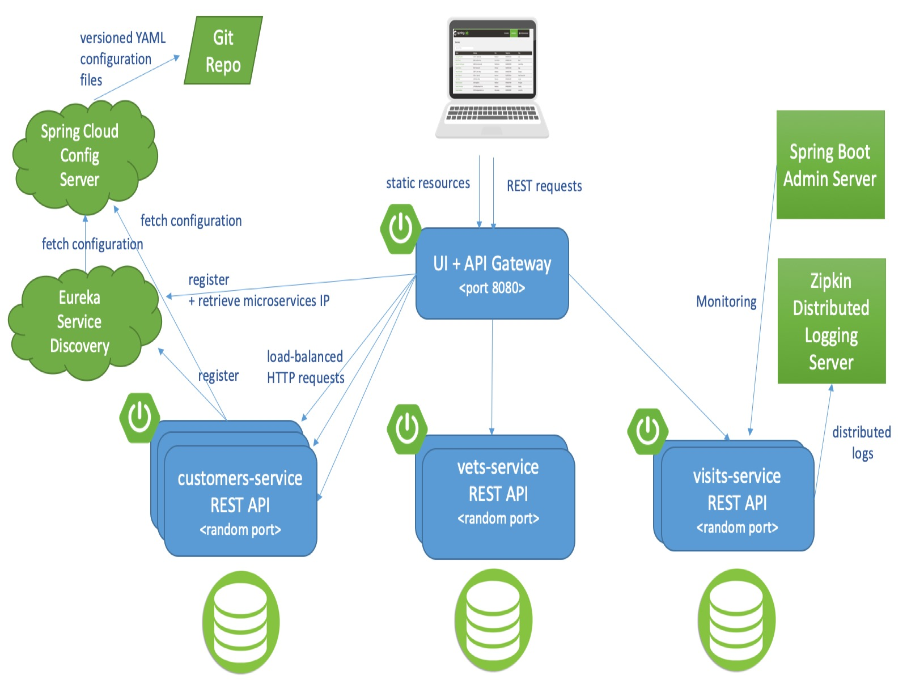

# Microservices CI/CD Pipeline

**End-to-end CI/CD pipeline for a Spring Boot microservices application on AWS & Kubernetes**

[](https://opensource.org/licenses/Apache-2.0)
[](https://www.jenkins.io/)
[](https://www.docker.com/)
[](https://kubernetes.io/)
[](https://aws.amazon.com/)
[](https://www.terraform.io/)
[](https://prometheus.io/)
[](https://grafana.com/)

</div>

---

## Overview

This project implements a **production-grade CI/CD pipeline** for the [Spring Petclinic Microservices](https://github.com/spring-petclinic/spring-petclinic-microservices) application — a distributed system built with Spring Cloud. The pipeline covers the full software delivery lifecycle: from local development through QA automation, staging, and production deployment on Kubernetes, with integrated monitoring via Prometheus and Grafana.

The project is structured around **29 Milestones (MSPs)** organized into epics that map directly to real-world DevOps workflows.

---

## Pipeline Architecture

```
┌──────────┐    ┌───────────────┐    ┌──────────┐    ┌─────────────┐    ┌────────────┐    ┌───────────┐
│  CODE    │───▶│  BUILD & TEST │───▶│ REGISTRY │───▶│ QA/STAGING  │───▶│ PRODUCTION │───▶│  MONITOR  │
│          │    │               │    │          │    │             │    │            │    │           │
│   Git    │    │    Jenkins    │    │ AWS ECR  │    │ EKS Cluster │    │ RKE + K8s  │    │Prometheus │
│  Maven   │    │    Docker     │    │ Nexus    │    │ Selenium    │    │ Rancher    │    │ Grafana   │
└──────────┘    └───────────────┘    └──────────┘    └─────────────┘    └────────────┘    └───────────┘
     │                 │                   │                 │                  │
  feature/*          dev/*            release/*          release/*           main/*
  bugfix/*                                              (nightly)            (weekly)
```

---

## Tech Stack

| Category                   | Tools                                                     |
| -------------------------- | --------------------------------------------------------- |
| **Application**            | Spring Boot, Spring Cloud Netflix (Eureka, Zuul, Hystrix) |
| **Build**                  | Maven Wrapper, Docker, Docker Compose                     |
| **CI/CD Server**           | Jenkins on AWS EC2                                        |
| **Container Registry**     | AWS ECR, Nexus Repository                                 |
| **Infrastructure as Code** | Terraform                                                 |
| **Kubernetes**             | AWS EKS (eksctl), RKE (High Availability), Rancher        |
| **QA Automation**          | Selenium, JUnit, JaCoCo (Code Coverage)                   |
| **Monitoring**             | Prometheus, Grafana, Micrometer, Zipkin (Tracing)         |
| **DNS & TLS**              | AWS Route 53, cert-manager, Let's Encrypt                 |

---

## Project Structure — MSP Overview

| Epic                          | MSPs            | Description                                                 |
| ----------------------------- | --------------- | ----------------------------------------------------------- |
| Local Development Environment | MSP-1 → MSP-5   | EC2 dev server, GitHub setup, Maven build, Terraform        |
| Local Development Build       | MSP-6 → MSP-8   | Dockerfiles, Docker Compose, image build scripts            |
| CI Server Setup               | MSP-9 → MSP-12  | Jenkins server, configuration, CI pipeline                  |
| Testing Environment           | MSP-11 → MSP-13 | Unit tests, code coverage (JaCoCo), Selenium                |
| Registry Setup                | MSP-14          | AWS ECR Docker registry via Jenkins job                     |
| QA Automation                 | MSP-15 → MSP-18 | Kubernetes QA environment, YAML manifests, nightly pipeline |
| QA for Release                | MSP-19 → MSP-22 | Permanent EKS QA infrastructure, weekly release pipeline    |
| Staging & Production          | MSP-23 → MSP-27 | HA RKE cluster, Rancher, Nexus, staging & prod pipelines    |
| Domain & TLS                  | MSP-28          | Route 53 DNS, cert-manager, Let's Encrypt SSL               |
| Monitoring                    | MSP-29          | Prometheus + Grafana NodePort services on Kubernetes        |

---

## Getting Started

### Prerequisites

- AWS CLI configured with appropriate IAM permissions
- `kubectl`, `eksctl`, `helm` installed
- Docker & Docker Compose
- Java 11 (Amazon Corretto recommended)
- Terraform >= 1.0

### 1 — Start services locally (without Docker)

Each microservice is a standalone Spring Boot application. Start Config Server and Discovery Server first:

```bash
# Config Server must start first
cd spring-petclinic-config-server && ../mvnw spring-boot:run

# Then Discovery Server
cd spring-petclinic-discovery-server && ../mvnw spring-boot:run

# Then remaining services
cd spring-petclinic-customers-service && ../mvnw spring-boot:run
cd spring-petclinic-vets-service      && ../mvnw spring-boot:run
cd spring-petclinic-visits-service    && ../mvnw spring-boot:run
cd spring-petclinic-api-gateway       && ../mvnw spring-boot:run
```

### 2 — Start services with Docker Compose

```bash
# Build all Docker images
./mvnw clean install -PbuildDocker

# Start the full stack
docker-compose up
```

### 3 — Access local services

| Service                 | URL                           |
| ----------------------- | ----------------------------- |
| API Gateway (Frontend)  | http://localhost:8080         |
| Eureka Discovery Server | http://localhost:8761         |
| Config Server           | http://localhost:8888         |
| Zipkin Tracing          | http://localhost:9411/zipkin/ |
| Prometheus              | http://localhost:9091         |
| Grafana                 | http://localhost:3000         |
| Spring Boot Admin       | http://localhost:9090         |

---

## CI/CD Pipelines

Three Jenkins pipelines cover the full delivery lifecycle:

**`petclinic-ci`** — Triggered on every push to `dev`, `feature/*`, and `bugfix/*` branches. Runs unit tests and generates code coverage reports.

**`petclinic-nightly`** — Triggered nightly on `dev` branch. Builds Docker images, pushes to ECR, deploys to QA Kubernetes environment, and runs Selenium automation tests.

**`petclinic-weekly`** — Triggered weekly on `release` branch. Deploys to staging environment on EKS, runs full QA suite, and promotes to production on merge to `main`.

**`petclinic-prod`** — Triggered on every commit to `main` via GitHub webhook. Deploys to the permanent production RKE Kubernetes cluster under `petclinic-prod-ns` namespace.

---

## Monitoring

Prometheus and Grafana are deployed on the Kubernetes cluster and exposed via NodePort services:

| Service    | NodePort |
| ---------- | -------- |
| Prometheus | 30002    |
| Grafana    | 30003    |

The Spring Petclinic services are instrumented with [Micrometer](https://micrometer.io/) and expose custom metrics via `@Timed` annotations:

- `petclinic.owner` and `petclinic.pet` — from `customers-service`
- `petclinic.visit` — from `visits-service`

A pre-built Grafana dashboard is available at:
`http://<node-ip>:30003/d/69JXeR0iw/spring-petclinic-metrics`

---

## Infrastructure

The production environment uses a **High Availability RKE Kubernetes cluster** on AWS EC2, managed via [Rancher](https://rancher.com/). The QA environment runs on **AWS EKS** provisioned with `eksctl`.

TLS certificates for the production domain are issued automatically via **Let's Encrypt** using `cert-manager` with the HTTP-01 ACME challenge.

---

## Application Screenshots

**Spring Petclinic UI**


**Microservices Architecture**



**Grafana Metrics Dashboard**


---

## Repository Structure

```
petclinic-microservices-with-db/
├── spring-petclinic-api-gateway/
├── spring-petclinic-config-server/
├── spring-petclinic-customers-service/
├── spring-petclinic-discovery-server/
├── spring-petclinic-vets-service/
├── spring-petclinic-visits-service/
├── spring-petclinic-admin-server/
├── spring-petclinic-ui/
├── jenkins/                        # Jenkinsfiles for all pipelines
├── kubernetes/                     # K8s YAML manifests
├── terraform/                      # IaC for dev/QA infrastructure
├── docker/                         # Dockerfiles & Compose files
├── ansible/                        # (optional) server provisioning
└── docker-compose.yml
```

---


---

## License

This project is licensed under the [Apache 2.0 License](https://opensource.org/licenses/Apache-2.0).
